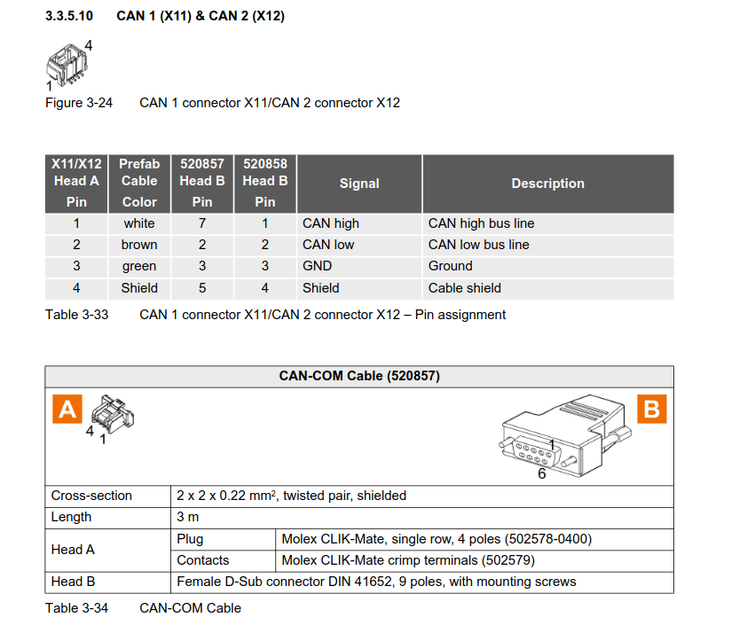
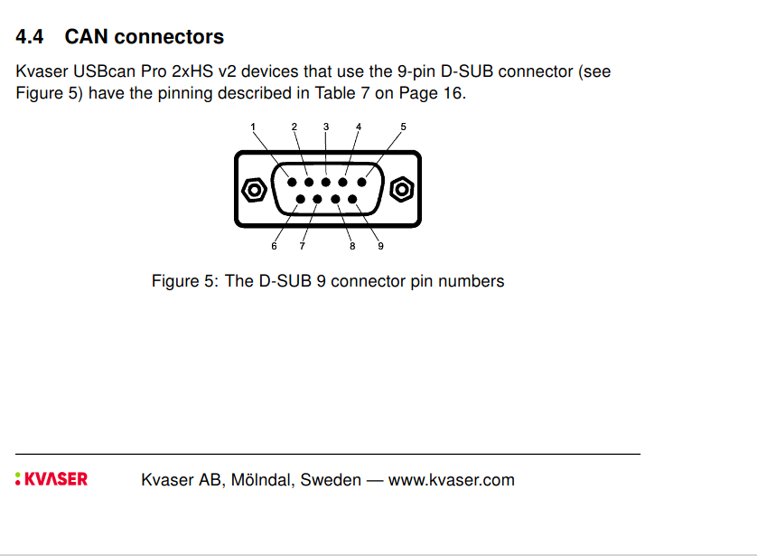

# mobile_robot
1. Install ROS2 Control
```bash 
sudo apt-get install ros-humble-ros2-control
```

2.  Install ROS2 controllers package
 ```bash
 sudo apt-get install ros-humble-ros2-controllers
 ```

3. Install Xacro Package

```bash
sudo apt-get install ros-humble-xacro
```
4. Install Gazebo

```bash
sudo apt-get install ros-humble-ros-gz*
```
5. Install Gazebo ROS2 control 

```bash
sudo apt-get install ros-humble-*-ros2-control
```
6. Install joint state publisher gui

```bash
sudo apt-get install ros-humble-joint-state-publisher-gui
```
7. Install Turtlesim node

```bash
sudo apt-get install ros-humble-turtlesim
```
8. Install Localization package

```bash
sudo apt-get install ros-humble-robot-localization
```
9. Install Joystick package

```bash
sudo apt-get install ros-humble-joy
```

10. Install Teleop package

```bash
sudo apt-get install ros-humble-joy
```
11.  Install TF Transformation 

```bash
sudo apt-get install ros-humble-tf-transformations

```

12. Install python package transform3d

```bash
pip install tranforms3d

```

# MAXON CAN COMMUNICATION 

## Hardware Setup

1. connect both EPOS controllers to each other using CAN to CAN connection cable and one of them to the kvaser 
2. Connect the CANH (While) of the EPOS4 to the CANH (pin 7) of kvaser and CANL(brown) to CANL (pin2) of kvaser, GND(green) to pin3 and shield to pin5 of kvaser connector


3. Slected the node ids by changing the dip switches in EPOS for controller (our case switch 1 for node id 1 and 2 for node id 2)


4. Turn on the terminator resister for both controll using dip switch 6. 


## Software Setup


1. Download the kvaser sdk


[Click Here](https://kvaser.com/product/kvaser-usbcan-pro-2xhs-v2/)

2. Install the header files by issuing the command

```bash

sudo apt-get install build-essential 

sudo apt-get install linux-headers-`uname -r` 

sudo apt-get install pkg-config 

```
3. Extract the sdk and navigate to linuxcan

```bash 
cd linuxcan
```
4. Build the Drivers

```bash
make
```
5. Install the Drivers

```bash
sudo make install
```
6. Install and load the virtual and PCI drivers

```bash
sudo make load
```
7. Navigate to the linuxcan-5.50-source-only.dkms and the dkms_source_tree and install the drivers

```bash
sudo make
sudo make install
```

8. Navigate to kvlibsdk-5.50.312 and install the drivers and then at the end

```bash
sudo make
sudo make install
sudo mod_probe kvaser_usb

```
9. Its better to remove the virtualcan by 

```bash
sudo modprobe -r kvvirtualcan

```
10. Reboot the system and then check  if it shows can0 using the command
```bash
ip link show

```
## Manual Testing

1. Bring of can0

```bash
sudo ip link set can0 up type can bitrate 1000000
```
2. Verify

```bash
ip link show can0

```
3.  Open the terminal and type

```bash
candump can0
```
4.  Open another terminal and paste these commonds one bye one for 20000rpms for node 1

```bash
# Set mode to Profile Velocity
cansend can0 601#2F60600003000000

# Shutdown
cansend can0 601#2B40600006000000

# Switch On
cansend can0 601#2B4060000F000000

# Enable Operation
cansend can0 601#2B4060001F000000

# Set target velocity = 20,000 rpm
cansend can0 601#23FF6000204E0000

# Wait 2 seconds
sleep 2

# Stop motor
cansend can0 601#2B40600000000000
```
## Maxon Epos4 Linux Library Setup

1.  Navigate to /EPOS-Linux-Library-En/EPOS_Linux_Library and type the command
```bash
sudo bash ./install.sh
```
2. Then navigat to the examples and type

```bash
make
```
3. Your cpp file should match like this
```bash
void SetDefaultParameters()
{
	//USB
	g_usNodeId = 1;
	g_deviceName = "EPOS4"; 
	g_protocolStackName = "CANopen"; 
	g_interfaceName = "CAN_kvaser_usb 0"; 
	g_portName = "CAN0"; 
	g_baudrate = 1000000; 
}
```
4. If you dont know about the the interface name and port name and protocolstackname then type 
```bash
./HelloEposCmd -l
```

5. Execute the executable HelloEposCmd

```bash
./HelloEposCmd
```